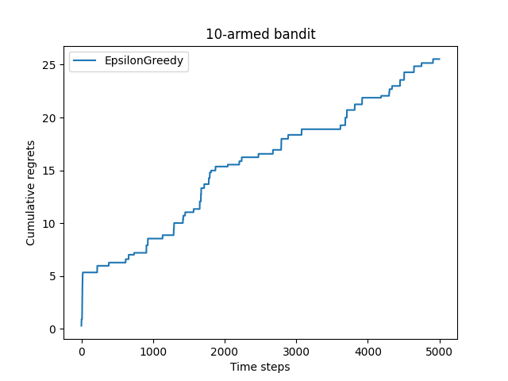
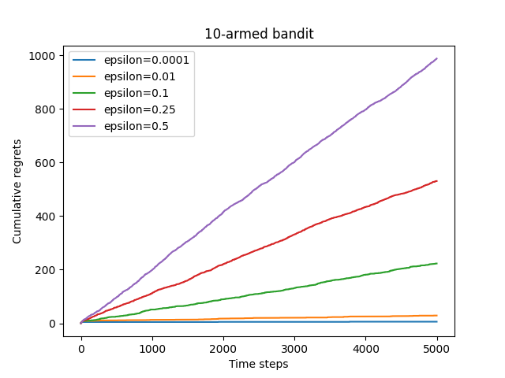
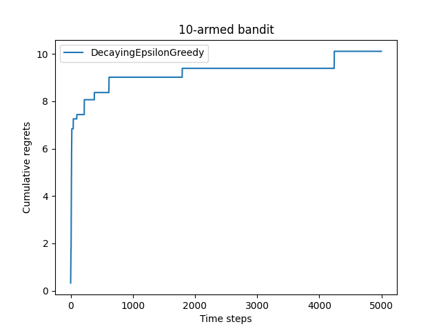

# 多臂老虎机

## 2.1 简介

强化学习关注智能体和环境交互过程中的学习，这是一种**试错型学习**(trial-and-error learning)范式。

多臂老虎机问题可以被看作简化版的强化学习问题。与强化学习不同，多臂老虎机不存在状态信息，只有动作和奖励。多臂老虎机中的探索与利用(exploration vs. exploitation)问题一直以来都是一个特别经典的问题，理解它能够帮助我们学习强化学习。

## 2.2 问题介绍

### 2.2.1 问题定义

在多臂老虎机(multi-armed bandit，MAB)问题中，有一个拥有$K$根拉杆的老虎机，拉动每一根拉杆都对应**一个关于奖励的概率分布** 。我们每次拉动其中一根拉杆，就可以从该拉杆对应的奖励概率分布中获得一个奖励 。

在**各根拉杆的奖励概率分布未知**的情况下，我们从头开始尝试，目标是**在操作$K$次拉杆后获得尽可能高的累积奖励**。由于奖励的概率分布是未知的，因此我们需要在“**探索**拉杆的获奖概率”和“根据经验**选择**获奖最多的拉杆”中进行权衡。


### 2.2.2 形式化描述

多臂老虎机问题可以表示为一个元组$\langle \mathcal A, \mathcal R\rangle$ ，其中：

-  $\mathcal A$为动作集合，其中一个动作表示**拉动一个拉杆**。若多臂老虎机一共有$K$根拉杆，那动作空间就是集合${a_1, ..., a_k}$，我们用$a_t \in \mathcal A$表示任意一个动作；
-  $\mathcal R$为奖励概率分布，拉动每一根拉杆的动作$a$都对应一个奖励概率分布$\mathcal R(r|a)$，**不同拉杆的奖励分布通常是不同的**。

假设每个时间步$t$只能拉动一个拉杆，多臂老虎机的目标为**最大化一段时间步内累积的奖励**，即
$$
max\sum_{t=1}^{T}{r_t}，其中r_t \sim \mathcal R(\cdot|a_t)
$$

其中$a_t$表示在第$t$时间步拉动某一拉杆的动作，$r_t$表示动作$a_t$获得的奖励。

### 2.2.3 累计懊悔

- 最优期望奖励

  对于每一个动作$a$，我们定义其期望奖励为$Q(a)=E_{r\sim R(\cdot|a)}{[r]}$。于是**至少存在一根拉杆**，它的期望奖励**不小于拉动其他任意一根拉杆**，我们将该最优期望奖励表示为
  $$
  Q^*=max_{a\in \mathcal A}{Q(a)}
  $$

- 懊悔(regret)

  为了更加直观、方便地观察拉动一根拉杆的期望奖励离最优拉杆期望奖励的差距，我们引入**懊悔**概念。懊悔定义为**拉动当前拉杆的动作与最优拉杆的期望奖励差**，即
  $$
  R(a)=Q^*-Q(a)
  $$
  **累积懊悔**(cumulative regret)即操作$T$次拉杆后累积的懊悔总量，对于一次完整的$T$步决策，累积懊悔为
  $$
  \sigma_R = \sum_{t=1}^{T}{R(a_t)}
  $$
  MAB问题的目标为最大化累积奖励，即等价于**最小化累积懊悔**。

### 2.2.4 估计期望的奖励

为了知道拉动哪一根拉杆能获得更高的奖励，我们需要**估计拉动这根拉杆的期望奖励**。由于只拉动一次拉杆获得的奖励存在随机性，所以需要多次拉动一根拉杆，然后计算得到的多次奖励的期望，其算法流程如下所示。

对于$\forall a \in \mathcal A$，初始化计数器$N(a)=0$和期望奖励估计$\hat{Q}(a)=0$

$for\space t = 1 \rightarrow T\space do$

​	  选取某根拉杆，该动作记为$a_t$

​	  得到奖励$r_t$

​	  更新计数器：$N(a_t) = N(a_t) + 1$

​	  更新期望奖励估值：$\hat{Q}(a_t)=\hat{Q}(a_t)+\frac{1}{N(a_t)}[r_t-\hat{Q}(a_t)]$

$end\space for$

> 注意：上述循环中的第四步采用公式推导如下：
> $$
> Q_k = \frac{1}{k}\sum_{i=1}^{k}r_i \\
> 	= \frac{1}{k}(r_k+\sum_{i=1}^{k-1}r_i) \\
> 	= \frac{1}{k}(r_k+(k-1)Q_{k-1}) \\
> 	= \frac{1}{k}(r_k+kQ_{k-1}-Q_{k-1}) \\
> 	= Q_{k-1} + \frac{1}{k}[r_k-Q_{k-1}]
> $$
> 如上述处理，在更新时的时间、空间复杂度均较低。同时需要注意，上述式中的：
>
> - $Q_k$表示第$k$次拉动某一根拉杆$j$时的期望奖励
> - $r_k$表示第$k$次拉动某一根拉杆$j$时的实际奖励

以下编写代码，实现一个拉杆数为10的多臂老虎机，其中每根拉杆的奖励服从**伯努利分布**，即每次拉下拉杆有$p$的概率获得的奖励为1(获奖)，有$1-p$的概率获得的奖励为0(未获奖)。

```python
# 多臂老虎机
import numpy as np
import matplotlib.pyplot as plt

class BernoulliBandit:
    '''
    伯努利多臂老虎机
    '''
    def __init__(self, K):
        '''
        多臂老虎机的初始化
        
        输入:
        K:老虎机拉杆数
        '''
        # 各拉杆的中奖概率
        self.probs = np.random.uniform(size=K)
       	# 获奖概率最大的杆和对应概率
        self.best_idx = np.argmax(self.probs)
        self.best_prob = self.probs[self.best_idx]
        # 杆数目
        self.K = K
        
	def step(self, k):
        '''
        玩家选择第k号杆子，依据拉杆获得奖励的概率返回是否获奖
        '''
        if np.random.rand() < self.probs[k]:
            return 1
        else:
            return 0
```

接下来用一个`Solver` 基础类来实现上述的多臂老虎机的求解方案。根据前文的算法流程，我们需要实现下列函数功能：**根据策略选择动作**、**根据动作获取奖励**、**更新期望奖励估值**、**更新累积懊悔和计数**。在下面的 MAB 算法基本框架中，我们将**根据策略选择动作**、**根据动作获取奖励**和**更新期望奖励估值**放在 `run_one_step()` 函数中，由每个继承 Solver 类的策略具体实现。而**更新累积懊悔和计数**则直接放在主循环 `run()` 中。

```python
class Solver:
    '''
    多臂老虎机的求解
    '''
    def __init__(self, bandit):
        '''
        针对多臂老虎机bandit的求解
        '''
        self.bandit = bandit
        self.counts = np.zeros(self.bandit.K) # 初始化每根拉杆的尝试次数
        self.regret = 0 # 当前步的累积懊悔
        self.actions = [] # 记录每一步的行动
        self.regrets = [] # 记录每一步的累积懊悔

    def update_regret(self, k):
        '''
        通过当前步的动作，更新累积懊悔

        参数:
        k:当前步骤的动作(拉动第k个拉杆)
        '''
        # 此时的最优拉杆期望为bandit.best_prob
        # 懊悔定义为拉动当前杆和最优杆之间的奖励期望之差
        self.regret += self.bandit.best_prob - self.bandit.probs[k]
        self.regrets.append(self.regret)

    def run_one_step(self):
        '''
        依据具体选择的策略，返回当前步选择的动作
        '''
        raise NotImplementedError
    
    def run(self, num_steps):
        '''
        进行num_steps次拉动杆
        '''
        for _ in range(num_steps):
            k = self.run_one_step() # 选择杆拉动
            self.counts[k] += 1 # 更新每根拉杆尝试记录
            self.actions.append(k) # 记录动作
            self.update_regret(k)
```

## 2.3 探索与利用的平衡

接下来我们将学习**如何设计一个策略**。在多臂老虎机问题中，一个经典的问题就是探索与利用的平衡问题：

- **探索**(exploration)是指尝试**拉动更多可能的拉杆**，这根拉杆不一定会获得最大的奖励，但这种方案能够摸清楚所有拉杆的获奖情况
- **利用**(exploitation)是指拉动**已知期望奖励最大的那根拉杆**

由于已知的信息仅仅来自有限次的交互观测，所以当前的最优拉杆不一定是全局最优的。因此，在多臂老虎机问题中，设计策略时就需要**平衡探索和利用的次数**，使得**累积奖励最大化**。一个比较常用的思路是在**开始时做比较多的探索**，在对每根拉杆都有比较准确的估计后，**再进行利用**。目前已有一些比较经典的算法来解决这个问题，例如$\epsilon$-贪婪算法、上置信界算法和汤普森采样算法等。

## 2.4 $\epsilon$-贪心算法

**完全贪婪算法**即在每一时刻采取**期望奖励估值最大**的动作，这就是纯粹的利用，而没有探索，所以通常需要对完全贪婪算法进行一些修改，其中比较经典的一种方法为$\epsilon$-贪婪($\epsilon-Greedy$)算法。

$\epsilon$-贪婪算法在完全贪婪算法的基础上**添加了噪声**，每次以概率$1-\epsilon$选择以往经验中期望奖励估值最大的那根拉杆(利用)，以概率$\epsilon$随机选择一根拉杆(探索)，公式如下：
$$
a_t=
\begin{cases}
argmax_{a\in \mathcal A},& \text{采样概率：}1-\epsilon \\
从\mathcal A中随机选择,& \text{采样概率：}\epsilon
\end{cases}
$$
随着探索次数的不断增加，我们对各个动作的奖励估计得越来越准，此时我们就没必要继续花大力气进行探索。所以在$\epsilon$-贪婪算法的具体实现中，我们**可以令$\epsilon$随时间衰减，即探索的概率将会不断降低**，但是不会在有限的步数内衰减至 0。代码如下所示：

```python
# 具体行动策略
# 1.ε-贪婪算法
class EpsilonGreedy(Solver):
    '''
    epsilon-贪婪算法
    '''
    def __init__(self, bandit, epsilon=0.01, init_prob=1.0):
        # 超类初始化
        super(EpsilonGreedy, self).__init__(bandit)
        # 探索概率
        self.epsilon = epsilon
        # 初始化拉杆的期望奖励估值
        self.estimates = np.array([init_prob] * self.bandit.K)

    def run_one_step(self):
        '''
        每一步行动
        '''
        # 拉动拉杆
        if np.random.random() < self.epsilon:
            k = np.random.randint(0, self.bandit.K) # 随机拉动一根拉杆
        else:
            k = np.argmax(self.estimates) # 当前期望奖励最大的拉杆

        r = self.bandit.step(k) # 得到当前奖励
        # 更新期望奖励
        self.estimates[k] += 1/(self.counts[k]+1) * (r - self.estimates[k])

        return k
        
# 直观显示累计函数
def plot_results(solvers, solver_names):
    '''
    绘制多种行动策略下的累积懊悔函数

    参数:
    solvers:策略组成的列表
    solver_names:策略列表名称
    '''
    for idx, solver in enumerate(solvers):
        time_list = range(len(solver.regrets))
        plt.plot(time_list, solver.regrets, label=solver_names[idx])
    plt.xlabel('Time steps')
    plt.ylabel('Cumulative regrets')
    plt.title('%d-armed bandit' % solvers[0].bandit.K)
    plt.legend()
    plt.show()

# 1.使用ε-贪婪算法
np.random.seed(1)
epsilon_greedy_solver = EpsilonGreedy(bandit_10_arm, epsilon=0.01)
epsilon_greedy_solver.run(5000) # 进行5000步的尝试
print('epsilon-贪婪算法的累积懊悔为：', epsilon_greedy_solver.regret)
plot_results([epsilon_greedy_solver], ['EpsilonGreedy'])
```

此时的结果如下：



可以发现累积懊悔随着实验次数几乎呈现线性增加。我们再选取其他不同的$\epsilon$值，实验代码如下：

```python
# 比较不同epsilon值下的累积懊悔变化
np.random.seed(0)
epsilons = [1e-4, 0.01, 0.1, 0.25, 0.5]
epsilon_greedy_solver_list = [
    EpsilonGreedy(bandit_10_arm, epsilon=epsilon) for epsilon in epsilons
]
epsilon_greedy_solver_names = [
    'epsilon={}'.format(epsilon) for epsilon in epsilons 
]
for solver in epsilon_greedy_solver_list:
    solver.run(5000)

plot_results(epsilon_greedy_solver_list, epsilon_greedy_solver_names)
```

结果如下：



累积懊悔随着实验次数还是近似线性增长，接下来尝试采用$\epsilon$随着时间衰减的$\epsilon$-贪婪算法，具体形式为反比例衰减，公式为
$$
\epsilon_t=\frac 1t
$$
代码如下：

```python
class DecayingEpsilonGreedy(Solver):
    """ epsilon值随时间衰减的epsilon-贪婪算法,继承Solver类 """
    def __init__(self, bandit, init_prob=1.0):
        super(DecayingEpsilonGreedy, self).__init__(bandit)
        self.estimates = np.array([init_prob] * self.bandit.K)
        self.total_count = 0

    def run_one_step(self):
        self.total_count += 1
        if np.random.random() < 1 / self.total_count:  # epsilon值随时间衰减
            k = np.random.randint(0, self.bandit.K)
        else:
            k = np.argmax(self.estimates)

        r = self.bandit.step(k)
        self.estimates[k] += 1. / (self.counts[k] + 1) * (r - self.estimates[k])

        return k
    
# 使用随时间衰减的epsilon-贪婪算法
np.random.seed(1)
decaying_epsilon_greedy_solver = DecayingEpsilonGreedy(bandit_10_arm)
decaying_epsilon_greedy_solver.run(5000) # 进行5000步的尝试
print('epsilon衰减的贪婪算法的累积懊悔为：', decaying_epsilon_greedy_solver.regret)
plot_results([decaying_epsilon_greedy_solver], ['DecayingEpsilonGreedy'])
```

此时结果如下：



上图的结果说明：随时间做**反比例衰减**的$\epsilon$-贪婪算法能够使累积懊悔与时间步的关系变成**次线性**(sublinear)，优于固定值情况。

## 2.5 上置信界算法

设想这样一种情况：对于一台双臂老虎机，其中第一根拉杆只被拉动过一次，得到的奖励为0；第二根拉杆被拉动过很多次，我们对它的奖励分布已经有了大致的把握。这时或许会进一步尝试拉动第一根拉杆，从而更加确定其奖励分布。这种思路主要是**基于不确定性**，因为此时第一根拉杆只被拉动过一次，它的不确定性很高。一根拉杆的**不确定性越大**，它就**越具有探索的价值**，因为探索之后我们可能发现它的期望奖励很大。

我们在此引入不确定性度量$U(a)$，它会随着动作$a$被尝试次数的增加而减小。我们可以使用一种**基于不确定性的策略**来综合考虑现有的期望奖励估值和不确定性，其核心问题是如何估计不确定性。

上置信界(upper confidence bound，UCB)法是一种经典的基于不确定性的策略算法，它是基于**霍夫丁不等式**。在霍夫丁不等式中，令$X_1, X_2, ..., X_n$为$n$个独立同分布的随机变量，取值范围为$[0,1]$，其经验期望为$\bar{x}_n=\frac 1n \sum_{j=1}^{n}{X_j}$，则有：
$$
\mathbb{P}\{E[X]\geq \bar{x}_n+u\}\leq e^{-2nu^2}
$$
现在我们将霍夫丁不等式运用于多臂老虎机问题中。将$\hat{Q}_t(a)$代入$\bar{x}_t$，令不等式中的参数$u=\hat{U}_t(a)$，代表不确定性度量。给定一个概率$p=e^{-2N_t(a)U_t(a)}$，根据上述不等式，$Q_t(a)<\hat{Q}_t(a)+\hat{U}_t(a)$至少以概率$1-p$成立。

当$p$很小时，$Q_t(a)<\hat{Q}_t(a)+\hat{U}_t(a)$就以很大概率成立，$\hat{Q}_t(a)+\hat{U}_t(a)$便是期望奖励上界。此时，上置信界算法便选取**期望奖励上界最大的动作**，即$a=argmax_{a\in \mathcal{A}}[\hat{Q}_t(a)+\hat{U}_t(a)]$。此时可以解得不确定性度量$\hat{U}_t(a)$满足：
$$
\hat{U}_t(a) = \sqrt{\frac{-log(p)}{2N_t(a)}}
$$

设定$p$作为**期望奖励超出界限的概率**后，就可以计算相应的不确定性度量了，即UCB 算法在每次选择拉杆前：

- 先计算每根拉杆的期望奖励的**上界**
- 接着选出期望奖励上界**最大**的拉杆

> 实际编写代码时：
>
> - 为了**平衡利用和探索**，我们设定$p$随时间倒数变化，则可以在前期多探索，后期多利用
> - 设定概率$p$后，为了防止计算不确定性度量时，分母为0，则在分母上加1
> - 为了平衡经验期望和不确定性度量，在取期望奖励上界最大动作时，给不确定性度量乘上系数$c$

以下是上置信界算法的实现：

```python
import numpy as np
import matplotlib.pyplot as plt

from multibandit import BernoulliBandit, Solver, plot_results

# 采用上置信界算法
class UCB(Solver):
    '''
    上置信界算法

    参数:
    bandit:多臂老虎机实例
    coef:不确定性度量在目标函数中的参数
    init_prob:每个杆的期望奖励概率初始化
    '''
    # 初始化
    def __init__(self, bandit, coef, init_prob=1.0):
        super(UCB, self).__init__(bandit)
        self.total_count = 0 # 记录当前时间步
        self.estimates = np.array([init_prob] * self.bandit.K) # 对每个杆的期望奖励估计
        self.coef = coef # 不确定性度量的参数

    # 选择该步的动作
    # 使用期望奖励上界最大的杆
    def run_one_step(self):
        self.total_count += 1
        exceed_prob = 1/self.total_count # 超过期望奖励上界的概率(与时间步成反比)
        ucb = self.estimates + self.coef * np.sqrt(
            - np.log(exceed_prob) / (2 * (self.counts + 1))
        )
        # 选取期望奖励上界最大的杆子
        k = np.argmax(ucb)
        r = self.bandit.step(k)
        self.estimates[k] += 1 / (self.counts[k]+1) * (r - self.estimates[k]) # 期望奖励更新公式

        return k

# 初始化10-臂老虎机
np.random.seed(1) # 设定随机数种子
K = 10 # 10臂老虎机
bandit_10_arm = BernoulliBandit(K)

np.random.seed(1)
coef = 1 # 控制不确定性比重的系数
UCB_solver = UCB(bandit_10_arm, coef)
UCB_solver.run(5000)
print('上置信界算法的累积懊悔为：', UCB_solver.regret)
plot_results([UCB_solver], ["UCB"])
```

结果如下所示：


