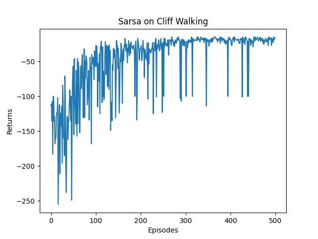

# 时序差分算法

## 5.1 简介

动态规划算法要求**马尔可夫决策过程是已知的**，即要求与智能体交互的环境是完全已知的。在此条件下，智能体可以直接用**动态规划算法就可以解出最优价值或策略**。这就好比对于有监督学习任务，如果直接显式给出了数据的分布公式，那么也可以通过在期望层面上直接最小化模型的泛化误差来更新模型参数，并不需要采样任何数据点。

对于**大部分强化学习现实场景**，其马尔可夫决策过程的**状态转移概率是无法写出来的**，也就无法直接进行动态规划。在这种情况下，智能体只能和环境进行交互，通过采样到的数据来学习，这类学习方法统称为**无模型的强化学习**(model-free reinforcement learning)。

不同于动态规划算法，**无模型的强化学习算法不需要事先知道环境的奖励函数和状态转移函数，**而是直接使用和环境交互的过程中**采样到的数据来学习**。本章将要讲解无模型的强化学习中的两大经典算法：`Sarsa`和`Q-learning`，它们都是基于**时序差分**(temporal difference, TD)的强化学习算法。同时，本章还会引入一组概念：**在线策略学习**和**离线策略学习**。

- **在线策略学习**：**使用在当前策略下采样得到的样本进行学习**，一旦策略被更新，当前的样本就被放弃了
- **离线策略学习**：**使用经验回放池将之前采样得到的样本收集起来再次利用**，就好像使用脸盆接水后洗手。

因此，离线策略学习往往能够更好地利用历史数据，并具有更小的样本复杂度(算法达到收敛结果需要在环境中采样的样本数量)，这使其被更广泛地应用。

## 5.2 时序差分算法

**时序差分**是一种用来估计一个策略的价值函数的方法，它**结合了蒙特卡洛和动态规划算法**的思想。时序差分方法和蒙特卡洛的相似之处在于**可以从样本数据中学习**，不需要事先知道环境；和动态规划的相似之处在于**根据贝尔曼方程的思想**，利用后续状态的价值估计来更新当前状态的价值估计。

- 蒙特卡洛方法对价值函数的增量更新方式：

$$
V(s_t) \leftarrow V(s_t) + \alpha [G_t - V(s_t)]
$$

这里采用 $\alpha$ 替换 $\frac{1}{N(s)}$ ，表示对价值估计更新的步长。蒙特卡洛方法必须要等整个序列结束之后才能计算得到这一次的回报 $G_t$ ，而时序差分方法只需要当前步结束即可进行计算。

- 具体来说，时序差分算法用当前获得的奖励 $r_t$ 加上下一个状态的价值估计 $V(s_{t+1})$ 来作为在当前状态会获得的回报，即：

$$
V(s_t) \leftarrow V(s_t) + \alpha [r_t + \gamma V(s_{t+1}) - V(s_t)]
$$

其中 $r_t + \gamma V(s_{t+1}) - V(s_t)$ 通常被称为**时序差分误差**(TD error)，时序差分算法将其与步长 $\alpha$ 的乘积作为状态价值的更新量。可以用来代替的原因是：
$$
V_{\pi}(s) = \mathbb{E}_{\pi}[G_t | S_t = s] \\
= \mathbb{E}_{\pi}[\sum_{k=0}^{\infty} {\gamma^k R_{t+k}} | S_t = s] \\
= \mathbb{E}_{\pi}[R_{t} + \sum_{k=1}^{\infty} {\gamma^k R_{t+k}} | S_t = s] \\
= \mathbb{E}_{\pi}[R_t + \gamma V_{\pi}(S_{t+1}) | S_t = s] \\
$$
蒙特卡洛方法将上式第一行作为更新的目标，而时序差分算法将上式最后一行作为更新的目标。

## 5.3 `Sarsa`算法

既然我们可以用**时序差分方法来估计价值函数**，那一个很自然的问题是，我们能否用类似**策略迭代**的方法来进行强化学习。策略评估已经可以通过时序差分算法实现，策略提升可以直接用时序差分算法来估计动作价值函数 $Q$ ：
$$
Q(s_t, a_t) \leftarrow Q(s_t, a_t) + \alpha [r_t + \gamma Q(s_{t+1}, a_{t+1}) - Q(s_t, a_t)]
$$
然后我们用贪婪算法来选取在某个状态下动作价值最大的那个动作，即 $\mathop{argmax}_{a}{Q(s, a)}$ 。

然而存在两个需要进一步考虑的问题：

- 如果要用时序差分算法来准确地估计策略的状态价值函数，我们需要用极大量的样本来进行更新。但实际上我们可以忽略这一点，直接用一些样本来评估策略，然后就可以更新策略了。我们可以这么做的原因是策略提升可以在策略评估未完全进行的情况进行，实际上**价值迭代**就是这样，这其实是**广义策略迭代**的思想。
- 如果在策略提升中一直**根据贪婪算法得到一个确定性策略**，可能会导致无法采样到某些状态动作对，以至于**无法对其动作价值进行估计**，进而无法保证策略提升后的策略比之前的好。此时，我们的解决办法是采用 $\epsilon -$贪婪策略，即有 $1-\epsilon$ 的概率采用动作价值最大的那个动作，另外有 $\epsilon$ 的概率从动作空间中随机采取一个动作，其公式表示为：

$$
\pi(a|s) = 
\begin{cases}
    \epsilon/|\mathcal{A}|+1-\epsilon, &\text{if } a = \mathop{argmax}_{a^{\prime}}Q(s, a^{\prime}) \\
	\epsilon/|\mathcal{A}|, &\text{其他动作}
 \end{cases}
$$

我们得到一个基于时序差分方法的强化学习算法——**`Sarsa`**，因为它的动作价值更新用到了当前状态$s$ 、当前动作 $a$ 、获得的奖励 $r$ 、下一个状态 $s^{\prime}$ 和下一个动作 $a^{\prime}$ ，将这些符号拼接后就得到了算法名称。`Sarsa`的具体算法如下：

初始化 $Q(s,a)$

$for$ 序列$e = 1 \rightarrow E$ do:

​	得到初始状态 $s$

​	用 $\epsilon-greedy$ 策略根据 $Q$ 选择当前状态 $s$ 下的动作 $a$ 

​	$for$ 时间步 $t=1 \rightarrow T$ do:

​		得到环境反馈的 $r, s^{\prime}$

​		用 $\epsilon-greedy$ 策略根据 $Q$ 选择当前状态 $s^{\prime}$ 下的动作 $a$

​		$Q(s, a) \leftarrow Q(s, a) + \alpha [r + \gamma Q(s^{\prime}, a^{\prime}) - Q(s, a)]$

​		$s \leftarrow s^{\prime}, a \leftarrow a^{\prime}$

​	$end \space for$

$end \space for$

在悬崖漫步环境下尝试`Sarsa`算法，由于是`model-free`模型，这里不需要提供奖励函数和状态转移函数，而是需要提供一个和智能体交互的函数`step()`，该函数将智能体动作作为输入，输出奖励和下一个状态给智能体。

```python
class CliffWalkingEnv:
    '''
    在Sarsa算法下的悬崖漫步环境
    '''
    def __init__(self, ncol, nrow):
        self.nrow = nrow
        self.ncol = ncol
        self.x = 0  # 记录当前智能体位置的横坐标，初始位置在左下角
        self.y = self.nrow - 1  # 记录当前智能体位置的纵坐标，初始位置在左下角

    def step(self, action):
        '''
        智能体采用action，返回此时的奖励和下一个状态
        '''
        # 4种动作, change[0]:上, change[1]:下, change[2]:左, change[3]:右。坐标系原点(0,0)
        change = [[0, -1], [0, 1], [-1, 0], [1, 0]]
        self.x = min(self.ncol - 1, max(0, self.x + change[action][0])) # 最大x不能超过self.ncol-1
        self.y = min(self.nrow - 1, max(0, self.y + change[action][1])) # 最大y不能超过self.nrow-1
        next_state = self.y * self.ncol + self.x # 下一个状态
        reward = -1
        done = False

        # 判断是否为终止状态以及终止状态下的奖励
        if self.y == self.nrow - 1 and self.x > 0:  # 下一个位置在悬崖或者目标
            done = True
            # 如果在悬崖
            if self.x != self.ncol - 1:
                reward = -100
                
        return next_state, reward, done

    def reset(self):
        '''
        回归初始状态,坐标轴原点在左上角
        '''
        self.x = 0
        self.y = self.nrow - 1
        return self.y * self.ncol + self.x
```

我们来实现`Sarsa`算法，主要维护一个表格`Q_table()`，用来储存当前策略下所有状态动作对的价值，在用`Sarsa`算法和环境交互时，用 $\epsilon-greedy$ 策略进行采样，在更新`Sarsa`算法时，使用时序差分的公式。我们默认终止状态时所有动作的价值都是0，这些价值在初始化为 0 后就不会进行更新。

```python
import matplotlib.pyplot as plt
import numpy as np
from tqdm import tqdm  # 显示循环进度条的库

from sarsa_cliff_walking_env import CliffWalkingEnv

# 定义Sarsa类
class Sarsa:
    '''
    Sarsa算法
    '''
    # Sarsa算法的初始化
    def __init__(self, ncol, nrow, epsilon, alpha, gamma, n_action=4):
        self.Q_table = np.zeros([nrow * ncol, n_action]) # 维护一个动作价值函数的表格
        self.n_action = n_action # 动作个数
        self.alpha = alpha # 学习率
        self.gamma = gamma # 折扣因子
        self.epsilon = epsilon # epsilon-贪婪中的参数

    # 依据当前状态选择动作
    def take_action(self, state):
        # 采用epsilon-贪婪策略
        if np.random.random() < self.epsilon:
            action = np.random.randint(self.n_action)
        else:
            action = np.argmax(self.Q_table[state])

        return action
    
    # 状态state下的最优动作
    def best_action(self, state):
        Q_max = np.max(self.Q_table[state]) # 最大动作价值
        a = [0 for _ in range(self.n_action)]
        for i in range(self.n_action):
            if self.Q_table[state, i] == Q_max:
                a[i] = 1

        return a
    
    # 更新动作价值函数
    def update(self, s0, a0, r, s1, a1):
        td_error = r + self.gamma * self.Q_table[s1, a1] - self.Q_table[s0, a0]
        self.Q_table[s0, a0] += self.alpha * td_error

# 打印Sarsa的策略
def print_agent(agent, env, action_meaning, disaster=[], end=[]):
    '''
    打印时序差分算法的策略
    '''
    for i in range(env.nrow):
        for j in range(env.ncol):
            if (i * env.ncol + j) in disaster:
                # 到达悬崖位置
                print('****', end=' ')
            elif (i * env.ncol + j) in end:
                # 到达终点
                print('EEEE', end=' ')
            else:
                # 其他位置
                a = agent.best_action(i * env.ncol + j) # 当前状态的最优策略
                pi_str = ''
                for k in range(len(action_meaning)):
                    pi_str += action_meaning[k] if a[k] > 0 else 'o'
                print(pi_str, end=' ')
        print("")

if __name__ == '__main__':
    ncol = 12
    nrow = 4
    env = CliffWalkingEnv(ncol, nrow) # 没有明确概率转移矩阵和奖励函数下的悬崖漫步环境
    np.random.seed(0) # 设置随机数种子
    epsilon = 0.1 # epsilon-贪婪的参数
    alpha = 0.1 # 学习率
    gamma = 0.9 # 折扣因子
    agent = Sarsa(ncol, nrow, epsilon, alpha, gamma)
    num_episodes = 500  # 智能体在环境中运行的序列的数量

    return_list = []
    for i in range(10):
        # tqdm进度条
        # 显示10个进度条
        with tqdm(total=int(num_episodes / 10), desc='Iteration %d' % i) as pbar:
            # 每个进度条50个序列
            for i_episode in range(int(num_episodes / 10)):
                episode_return = 0 # 当前序列的回报
                state = env.reset() # 重置状态
                action = agent.take_action(state)
                done = False

                # 采样到序列结束
                while not done:
                    # 进行一次SARSA
                    next_state, reward, done = env.step(action) # 环境给出奖励和下一阶段的状态
                    next_action = agent.take_action(next_state)
                    episode_return += reward # 这里的回报计算不进行折扣因子衰减
                    agent.update(state, action, reward, next_state, next_action) # 更新动作价值函数
                    # 更新state和action
                    state = next_state
                    action = next_action

                # 记录序列的回报
                return_list.append(episode_return)

                # 每10条序列打印下平均回报
                if (i_episode + 1) % 10 == 0:
                    pbar.set_postfix({
                        'episode': '%d' % (num_episodes / 10 * i + i_episode + 1),
                        'return': '%.3f' % np.mean(return_list[-10:])
                    })
                pbar.update(1)

# 打印回报变化过程
# 此时的回报并不要折扣因子衰减
episodes_list = list(range(len(return_list)))
plt.plot(episodes_list, return_list)
plt.xlabel('Episodes')
plt.ylabel('Returns')
plt.title('Sarsa on {}'.format('Cliff Walking'))
plt.show()

action_meaning = ['^', 'v', '<', '>']
print('Sarsa算法最终收敛得到的策略为：')
print_agent(agent, env, action_meaning, list(range(37, 47)), [47])
```

此时，我们得到序列回报随着迭代的变化图如下：



