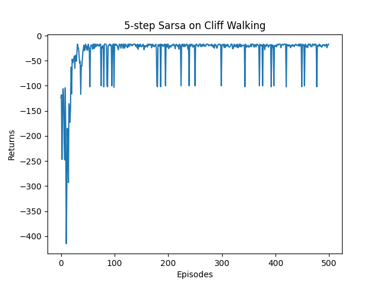
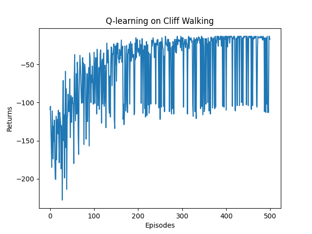

# 时序差分算法

## 5.1 简介

动态规划算法要求**马尔可夫决策过程是已知的**，即要求与智能体交互的环境是完全已知的。在此条件下，智能体可以直接用**动态规划算法就可以解出最优价值或策略**。这就好比对于有监督学习任务，如果直接显式给出了数据的分布公式，那么也可以通过在期望层面上直接最小化模型的泛化误差来更新模型参数，并不需要采样任何数据点。

对于**大部分强化学习现实场景**，其马尔可夫决策过程的**状态转移概率是无法写出来的**，也就无法直接进行动态规划。在这种情况下，智能体只能和环境进行交互，通过采样到的数据来学习，这类学习方法统称为**无模型的强化学习**(model-free reinforcement learning)。

不同于动态规划算法，**无模型的强化学习算法不需要事先知道环境的奖励函数和状态转移函数，**而是直接使用和环境交互的过程中**采样到的数据来学习**。本章将要讲解无模型的强化学习中的两大经典算法：`Sarsa`和`Q-learning`，它们都是基于**时序差分**(temporal difference, TD)的强化学习算法。同时，本章还会引入一组概念：**在线策略学习**和**离线策略学习**。

- **在线(online)策略学习**：**使用在当前策略下采样得到的样本进行学习**，一旦策略被更新，当前的样本就被放弃了
- **离线(offline)策略学习**：**使用经验回放池将之前采样得到的样本收集起来再次利用**，就好像使用脸盆接水后洗手。

因此，离线策略学习往往能够更好地利用历史数据，并具有更小的样本复杂度(算法达到收敛结果需要在环境中采样的样本数量)，这使其被更广泛地应用。

## 5.2 时序差分算法

**时序差分**是一种用来估计一个策略的价值函数的方法，它**结合了蒙特卡洛和动态规划算法**的思想。时序差分方法和蒙特卡洛的相似之处在于**可以从样本数据中学习**，不需要事先知道环境；和动态规划的相似之处在于**根据贝尔曼方程的思想**，利用后续状态的价值估计来更新当前状态的价值估计。

- 蒙特卡洛方法对价值函数的增量更新方式：

$$
V(s_t) \leftarrow V(s_t) + \alpha [G_t - V(s_t)]
$$

这里采用 $\alpha$ 替换 $\frac{1}{N(s)}$ ，表示对价值估计更新的步长。蒙特卡洛方法必须要等整个序列结束之后才能计算得到这一次的回报 $G_t$ ，而时序差分方法只需要当前步结束即可进行计算。

- 具体来说，时序差分算法用当前获得的奖励 $r_t$ 加上下一个状态的价值估计 $V(s_{t+1})$ 来作为在当前状态会获得的回报，即：

$$
V(s_t) \leftarrow V(s_t) + \alpha [r_t + \gamma V(s_{t+1}) - V(s_t)]
$$

其中 $r_t + \gamma V(s_{t+1}) - V(s_t)$ 通常被称为**时序差分误差**(TD error)，时序差分算法将其与步长 $\alpha$ 的乘积作为状态价值的更新量。可以用来代替的原因是：
$$
V_{\pi}(s) = \mathbb{E}_{\pi}[G_t | S_t = s] \\
= \mathbb{E}_{\pi}[\sum_{k=0}^{\infty} {\gamma^k R_{t+k}} | S_t = s] \\
= \mathbb{E}_{\pi}[R_{t} + \sum_{k=1}^{\infty} {\gamma^k R_{t+k}} | S_t = s] \\
= \mathbb{E}_{\pi}[R_t + \gamma V_{\pi}(S_{t+1}) | S_t = s] \\
$$
蒙特卡洛方法将上式第一行作为更新的目标，而时序差分算法将上式最后一行作为更新的目标。

## 5.3 `Sarsa`算法

既然我们可以用**时序差分方法来估计价值函数**，那一个很自然的问题是，我们能否用类似**策略迭代**的方法来进行强化学习。策略评估已经可以通过时序差分算法实现，策略提升可以直接用时序差分算法来估计动作价值函数 $Q$ ：
$$
Q(s_t, a_t) \leftarrow Q(s_t, a_t) + \alpha [r_t + \gamma Q(s_{t+1}, a_{t+1}) - Q(s_t, a_t)]
$$
然后我们用贪婪算法来选取在某个状态下动作价值最大的那个动作，即 $\mathop{argmax}_{a}{Q(s, a)}$ 。

然而存在两个需要进一步考虑的问题：

- 如果要用时序差分算法来准确地估计策略的状态价值函数，我们需要用极大量的样本来进行更新。但实际上我们可以忽略这一点，直接用一些样本来评估策略，然后就可以更新策略了。我们可以这么做的原因是策略提升可以在策略评估未完全进行的情况进行，实际上**价值迭代**就是这样，这其实是**广义策略迭代**的思想。
- 如果在策略提升中一直**根据贪婪算法得到一个确定性策略**，可能会导致无法采样到某些状态动作对，以至于**无法对其动作价值进行估计**，进而无法保证策略提升后的策略比之前的好。此时，我们的解决办法是采用 $\epsilon -$贪婪策略，即有 $1-\epsilon$ 的概率采用动作价值最大的那个动作，另外有 $\epsilon$ 的概率从动作空间中随机采取一个动作，其公式表示为：

$$
\pi(a|s) = 
\begin{cases}
    \epsilon/|\mathcal{A}|+1-\epsilon, &\text{if } a = \mathop{argmax}_{a^{\prime}}Q(s, a^{\prime}) \\
	\epsilon/|\mathcal{A}|, &\text{其他动作}
 \end{cases}
$$

我们得到一个基于时序差分方法的强化学习算法——**`Sarsa`**，因为它的动作价值更新用到了当前状态$s$ 、当前动作 $a$ 、获得的奖励 $r$ 、下一个状态 $s^{\prime}$ 和下一个动作 $a^{\prime}$ ，将这些符号拼接后就得到了算法名称。`Sarsa`的具体算法如下：

初始化 $Q(s,a)$

$for$ 序列$e = 1 \rightarrow E$ do:

​	得到初始状态 $s$

​	用 $\epsilon-greedy$ 策略根据 $Q$ 选择当前状态 $s$ 下的动作 $a$ 

​	$for$ 时间步 $t=1 \rightarrow T$ do:

​		得到环境反馈的 $r, s^{\prime}$

​		用 $\epsilon-greedy$ 策略根据 $Q$ 选择当前状态 $s^{\prime}$ 下的动作 $a$

​		$Q(s, a) \leftarrow Q(s, a) + \alpha [r + \gamma Q(s^{\prime}, a^{\prime}) - Q(s, a)]$

​		$s \leftarrow s^{\prime}, a \leftarrow a^{\prime}$

​	$end \space for$

$end \space for$

在悬崖漫步环境下尝试`Sarsa`算法，由于是`model-free`模型，这里不需要提供奖励函数和状态转移函数，而是需要提供一个和智能体交互的函数`step()`，该函数将智能体动作作为输入，输出奖励和下一个状态给智能体。

```python
class CliffWalkingEnv:
    '''
    在Sarsa算法下的悬崖漫步环境
    '''
    def __init__(self, ncol, nrow):
        self.nrow = nrow
        self.ncol = ncol
        self.x = 0  # 记录当前智能体位置的横坐标，初始位置在左下角
        self.y = self.nrow - 1  # 记录当前智能体位置的纵坐标，初始位置在左下角

    def step(self, action):
        '''
        智能体采用action，返回此时的奖励和下一个状态
        '''
        # 4种动作, change[0]:上, change[1]:下, change[2]:左, change[3]:右。坐标系原点(0,0)
        change = [[0, -1], [0, 1], [-1, 0], [1, 0]]
        self.x = min(self.ncol - 1, max(0, self.x + change[action][0])) # 最大x不能超过self.ncol-1
        self.y = min(self.nrow - 1, max(0, self.y + change[action][1])) # 最大y不能超过self.nrow-1
        next_state = self.y * self.ncol + self.x # 下一个状态
        reward = -1
        done = False

        # 判断是否为终止状态以及终止状态下的奖励
        if self.y == self.nrow - 1 and self.x > 0:  # 下一个位置在悬崖或者目标
            done = True
            # 如果在悬崖
            if self.x != self.ncol - 1:
                reward = -100
                
        return next_state, reward, done

    def reset(self):
        '''
        回归初始状态,坐标轴原点在左上角
        '''
        self.x = 0
        self.y = self.nrow - 1
        return self.y * self.ncol + self.x
```

我们来实现`Sarsa`算法，主要维护一个表格`Q_table()`，用来储存当前策略下所有状态动作对的价值，在用`Sarsa`算法和环境交互时，用 $\epsilon-greedy$ 策略进行采样，在更新`Sarsa`算法时，使用时序差分的公式。我们默认终止状态时所有动作的价值都是0，这些价值在初始化为 0 后就不会进行更新。

```python
import matplotlib.pyplot as plt
import numpy as np
from tqdm import tqdm  # 显示循环进度条的库

from sarsa_cliff_walking_env import CliffWalkingEnv

# 定义Sarsa类
class Sarsa:
    '''
    Sarsa算法
    '''
    # Sarsa算法的初始化
    def __init__(self, ncol, nrow, epsilon, alpha, gamma, n_action=4):
        self.Q_table = np.zeros([nrow * ncol, n_action]) # 维护一个动作价值函数的表格
        self.n_action = n_action # 动作个数
        self.alpha = alpha # 学习率
        self.gamma = gamma # 折扣因子
        self.epsilon = epsilon # epsilon-贪婪中的参数

    # 依据当前状态选择动作
    def take_action(self, state):
        # 采用epsilon-贪婪策略
        if np.random.random() < self.epsilon:
            action = np.random.randint(self.n_action)
        else:
            action = np.argmax(self.Q_table[state])

        return action
    
    # 状态state下的最优动作
    def best_action(self, state):
        Q_max = np.max(self.Q_table[state]) # 最大动作价值
        a = [0 for _ in range(self.n_action)]
        for i in range(self.n_action):
            if self.Q_table[state, i] == Q_max:
                a[i] = 1

        return a
    
    # 更新动作价值函数
    def update(self, s0, a0, r, s1, a1):
        td_error = r + self.gamma * self.Q_table[s1, a1] - self.Q_table[s0, a0]
        self.Q_table[s0, a0] += self.alpha * td_error

# 打印Sarsa的策略
def print_agent(agent, env, action_meaning, disaster=[], end=[]):
    '''
    打印时序差分算法的策略
    '''
    for i in range(env.nrow):
        for j in range(env.ncol):
            if (i * env.ncol + j) in disaster:
                # 到达悬崖位置
                print('****', end=' ')
            elif (i * env.ncol + j) in end:
                # 到达终点
                print('EEEE', end=' ')
            else:
                # 其他位置
                a = agent.best_action(i * env.ncol + j) # 当前状态的最优策略
                pi_str = ''
                for k in range(len(action_meaning)):
                    pi_str += action_meaning[k] if a[k] > 0 else 'o'
                print(pi_str, end=' ')
        print("")

if __name__ == '__main__':
    ncol = 12
    nrow = 4
    env = CliffWalkingEnv(ncol, nrow) # 没有明确概率转移矩阵和奖励函数下的悬崖漫步环境
    np.random.seed(0) # 设置随机数种子
    epsilon = 0.1 # epsilon-贪婪的参数
    alpha = 0.1 # 学习率
    gamma = 0.9 # 折扣因子
    agent = Sarsa(ncol, nrow, epsilon, alpha, gamma)
    num_episodes = 500  # 智能体在环境中运行的序列的数量

    return_list = []
    for i in range(10):
        # tqdm进度条
        # 显示10个进度条
        with tqdm(total=int(num_episodes / 10), desc='Iteration %d' % i) as pbar:
            # 每个进度条50个序列
            for i_episode in range(int(num_episodes / 10)):
                episode_return = 0 # 当前序列的回报
                state = env.reset() # 重置状态
                action = agent.take_action(state)
                done = False

                # 采样到序列结束
                while not done:
                    # 进行一次SARSA
                    next_state, reward, done = env.step(action) # 环境给出奖励和下一阶段的状态
                    next_action = agent.take_action(next_state)
                    episode_return += reward # 这里的回报计算不进行折扣因子衰减
                    agent.update(state, action, reward, next_state, next_action) # 更新动作价值函数
                    # 更新state和action
                    state = next_state
                    action = next_action

                # 记录序列的回报
                return_list.append(episode_return)

                # 每10条序列打印下平均回报
                if (i_episode + 1) % 10 == 0:
                    pbar.set_postfix({
                        'episode': '%d' % (num_episodes / 10 * i + i_episode + 1),
                        'return': '%.3f' % np.mean(return_list[-10:])
                    })
                pbar.update(1)

    # 打印回报变化过程
    # 此时的回报并不要折扣因子衰减
    episodes_list = list(range(len(return_list)))
    plt.plot(episodes_list, return_list)
    plt.xlabel('Episodes')
    plt.ylabel('Returns')
    plt.title('Sarsa on {}'.format('Cliff Walking'))
    plt.show()

    action_meaning = ['^', 'v', '<', '>']
    print('Sarsa算法最终收敛得到的策略为：')
    print_agent(agent, env, action_meaning, list(range(37, 47)), [47])
```

此时，我们得到序列回报随着迭代的变化图如下：


## 5.4 多步`Sarsa`算法

蒙特卡洛方法从起始状态采样到终止状态，利用当前状态之后每一步的奖励而不使用任何价值估计；时序差分算法只利用一步奖励和下一个状态的价值估计。

- 蒙特卡洛方法是**无偏**(unbiased)的，但是具有**比较大的方差**，因为每一步的状态转移都有不确定性，而每一步状态采取的动作所得到的不一样的奖励最终都会加起来，这会极大影响最终的价值估计
- 时序差分算法具有**非常小的方差**，因为只关注了一步状态转移，用到了一步的奖励，但是它是**有偏**的，因为用到了下一个状态的价值估计而不是其真实的价值。

可以使用**多步时序差分**结合两者的优点，实现方差和偏差的平衡。多步时序差分使用 $n$ 步的奖励，然后使用之后状态的价值估计，即：
$$
G_t = r_t + \gamma r_{t+1} + \cdots + \gamma^{n} Q(s_{t+n}, a_{t+n})
$$
多步`Sarsa`算法把`Sarsa`算法中的动作价值函数的更新公式变为：
$$
Q(s_t, a_t) \leftarrow Q(s_t, a_t) + \alpha [r_t + \gamma r_{t+1} + \cdots + \gamma^{n} Q(s_{t+n}, a_{t+n}) - Q(s_t, a_t)]
$$
我们接下来用代码实现多步( $n$ 步)`Sarsa`算法，在`Sarsa`代码的基础上进行修改，引入多步时序差分计算。

```python
import numpy as np
import matplotlib.pyplot as plt
from tqdm import tqdm

from sarsa_cliff_walking_env import CliffWalkingEnv

class nstep_sarsa:
    '''
    多步Sarsa算法

    输入:
    :param n: n步
    :param ncol: 列数
    :param nrow: 行数
    :param epsilon: epsilon-greedy中的参数
    :param alpha: 学习率
    :param gamma: 折扣因子
    :param n_action: 动作个数
    '''
    def __init__(self, n, ncol, nrow, epsilon, alpha, gamma, n_action=4):
        self.Q_table = np.zeros([nrow * ncol, n_action]) # 动作价值函数表格
        self.n_action = n_action # 动作个数
        self.alpha = alpha # 学习率
        self.gamma = gamma # 折扣因子
        self.epsilon = epsilon # epsilon-greedy中的参数
        self.n = n # 采用n步Sarsa算法

        # 由于需要n步Sarsa，需要记录n步过程，用于后续更新动作价值函数
        self.state_list = [] # 保存之前的状态
        self.action_list = [] # 保存之前的动作
        self.reward_list = [] # 保存之前的奖励

    # 采用epsilon-greedy策略
    def take_action(self, state):
        if np.random.random() < self.epsilon:
            action = np.random.randint(self.n_action) # 采用随机策略
        else:
            action = np.argmax(self.Q_table[state]) # 采用贪婪策略

        return action
    
    # 打印策略，即展示状态state下的最优行动
    def best_action(self, state):
        Q_max = np.max(self.Q_table[state])
        a = [0 for _ in range(self.n_action)] # 记录state下的行动
        for i in range(self.n_action):
            if self.Q_table[state, i] == Q_max:
                a[i] = 1

        return a
    
    # 更新动作价值函数，即更新Q_table
    def update(self, s0, a0, r, s1, a1, done):
        # 加上状态s0, a0
        self.state_list.append(s0)
        self.action_list.append(a0)
        self.reward_list.append(r)

        # 如果已有n步的数据
        if len(self.state_list) == self.n:
            G = self.Q_table[s1, a1] # 得到Q(s_{t+n}, a_{t+n})
            # 从n步往前推
            for i in reversed(range(self.n)):
                G = self.gamma * G + self.reward_list[i] # 向前计算

                # 如果序列最后达到终止，即使最后几步的后面没有n步，也可以采用多步Sarsa更新
                if done and i > 0:
                    s = self.state_list[i]
                    a = self.action_list[i]
                    self.Q_table[s, a] += self.alpha * (G - self.Q_table[s, a]) # 多步Sarsa的更新公式

            # 更新列表中第0个状态并删除
            s = self.state_list.pop(0)
            a = self.action_list.pop(0)
            self.reward_list.pop(0)
            # 多步Sarsa的更新
            self.Q_table[s, a] += self.alpha * (G - self.Q_table[s, a])

        # 如果是终止状态，重新采样序列
        if done:
            self.state_list = []
            self.action_list = []
            self.reward_list = []

if __name__ == '__main__':
    ncol = 12
    nrow = 4
    np.random.seed(0)
    n_step = 5
    alpha = 0.1
    epsilon = 0.1
    gamma = 0.9
    agent = nstep_sarsa(n_step, ncol, nrow, epsilon, alpha, gamma)
    env = CliffWalkingEnv(ncol, nrow)
    num_episodes = 500 # 智能体采样序列数目

    return_list = []
    for i in range(10):
        # tqdm进度条
        with tqdm(total=int(num_episodes / 10), desc='Iteration %d' % i) as pbar:
            for i_episode in range(int(num_episodes / 10)):  # 每个进度条的序列数
                episode_return = 0 # 当前序列的回报
                state = env.reset()
                action = agent.take_action(state)
                done = False

                # 采样一条序列
                while not done:
                    next_state, reward, done = env.step(action)
                    next_action = agent.take_action(next_state)
                    episode_return += reward  # 这里回报的计算不进行折扣因子衰减
                    agent.update(state, action, reward, next_state, next_action, done)
                    state = next_state
                    action = next_action
                return_list.append(episode_return)
                
                if (i_episode + 1) % 10 == 0:  # 每10条序列打印一下这10条序列的平均回报
                    pbar.set_postfix({
                        'episode':
                        '%d' % (num_episodes / 10 * i + i_episode + 1),
                        'return':
                        '%.3f' % np.mean(return_list[-10:])
                    })
                pbar.update(1)

    episodes_list = list(range(len(return_list)))
    plt.plot(episodes_list, return_list)
    plt.xlabel('Episodes')
    plt.ylabel('Returns')
    plt.title('5-step Sarsa on {}'.format('Cliff Walking'))
    plt.show()
```

此时，我们得到序列回报随着迭代的变化图如下：



## 5.5 Q-learning算法

Q-learning算法也是基于时序差分算法的强化学习算法，它和`Sarsa`的最大区别在于Q-learning时序差分算法的更新方式为：
$$
Q(s_t, a_t) \leftarrow Q(s_t, a_t) + \alpha [R_t + \gamma \mathop{max}_{a}Q(s_{t+1}, a) - Q(s_t, a_t)]
$$
Q-learning的主要思想是**价值迭代**，即Q-learning是直接在估计 $Q^*$ ，因为动作价值函数 $Q(s, a)$ 的贝尔曼最优方程是：
$$
Q^*(s, a) = r(s, a) + \gamma \sum_{s^{\prime} \in \mathcal{S}}{P(s^{\prime}|s, a) \mathop{max}_{a^{\prime}}{Q^*(s, a^{\prime})}}
$$
而`Sarsa`估计的是当前 $\epsilon-greedy$ 策略的动作价值函数 $Q(s, a)$ 。

- Q-learning是**异策学习(off-policy)**策略：不需要与环境进行交互，使用收集好的经验数据，从中选择任意的 $(s, a, r, s^{\prime})$，利用贝尔曼最优性方程即可进行更新；
- `Sarsa`是**同策学习(on-policy)**策略：需要与环境之间交互，获取下一个状态 $s^{\prime}$ 和 $a^{\prime}$ ，用贝尔曼期望方程进行更新。

Q-learning算法的主要流程如下：

初始化 $Q(s, a)$

$for$ 序列 $e=1 \rightarrow E \space do$ :

​	得到初始状态 $s$

​	$for$ 时间步 $t=1 \rightarrow T \space do$ :

​		用 $\epsilon-greedy$ 策略根据 $Q$ 选择当前状态 $s$ 下的动作 $a$  

​		得到环境反馈的 $r, s^{\prime}$

​		$Q(s, a) \leftarrow Q(s, a) + \alpha [r + \gamma \mathop{max}_{a^{\prime}}{Q(s^{\prime}, a^{\prime})} - Q(s, a)]$

​		$s \leftarrow s^{\prime}$

​	$end \space for$

$end \space for$

> 区分同策策略算法和异策策略算法：我们称采样数据的策略为**行为策略**(behavior policy)，称用这些数据来更新的策略为**目标策略**(target policy)。同策(on-policy)算法表示行为策略和目标策略是同一个策略；而异策(off-policy)算法表示行为策略和目标策略不是同一个策略。
>
> - 对于`Sarsa`，它的更新公式必须使用来自当前策略采样得到的五元组 $(s, a, r, s^{\prime}, a^{\prime})$ ，因此它是同策策略学习方法；
> - 对于Q-learning，它的更新公式使用的是四元组 $(s, a, r, s^{\prime})$ 来更新当前状态动作对的价值 $Q(s, a)$，数据中的 $s$ 和 $a$ 是给定的条件，$r$ 和 $s^{\prime}$ 皆由环境采样得到，该四元组并不需要一定是当前策略采样得到的数据，也可以来自行为策略，因此它是异策策略算法。
>
> 
>
> on-policy算法和off-policy各自的优缺点如下所示：
>
> - on-policy算法：
>   - 优点：简单直接，易于实现；理论上可以收敛到最优策略。
>   - 缺点：样本利用率低,只能使用策略生成的样本进行学习,不能复用其他样本；学习速度慢,需要大量样本才能学习到好的策略。
> - off-policy算法：
>   - 优点：可以利用历史数据,样本利用率高,学习速度快；可以并行的学习多个策略。
>   - 缺点：实现比较复杂,需要额外的技巧如重要性采样来**解决偏差问题**；理论上难**以保证收敛到最优策略**；可能导致振荡和不稳定,需要小心选择算法超参数。

接下来实现Q-learning算法：

```python
import numpy as np
import matplotlib.pyplot as plt
from tqdm import tqdm

from sarsa_cliff_walking_env import CliffWalkingEnv, print_agent

class QLearning:
    '''
    Q-Learning算法
    '''
    def __init__(self, ncol, nrow, epsilon, alpha, gamma, n_action=4):
        self.Q_table = np.zeros([nrow * ncol, n_action]) # 初始化最优动作价值函数
        self.n_action = n_action # 动作个数
        self.alpha = alpha # 学习率
        self.gamma = gamma # 折扣因子
        self.epsilon = epsilon # epsilon-greedy策略中的参数

    # 动作选择 -> 采样状态动作对(s,a)
    def take_action(self, state):
        # 采用epsilon-greedy策略
        if np.random.random() < self.epsilon:
            action = np.random.randint(self.n_action)
        else:
            action = np.argmax(self.Q_table[state])
        
        return action

    # 最优动作 -> 便于之后打印动作
    def best_action(self, state):
        Q_max = np.max(self.Q_table[state])
        a = [0 for i in range(self.n_action)] # 初始化动作
        for i in range(self.n_action):
            if self.Q_table[state, i] == Q_max:
                a[i] = 1

        return a
    
    def update(self, s0, a0, r, s1):
        # 更新最优动作价值函数时采用的策略是纯贪婪策略
        td_error = r + self.gamma * self.Q_table[s1].max() - self.Q_table[s0, a0]
        self.Q_table[s0, a0] += self.alpha * td_error

if __name__ == '__main__':
    ncol = 12
    nrow = 4
    np.random.seed(0)
    epsilon = 0.1
    alpha = 0.1
    gamma = 0.9
    agent = QLearning(ncol, nrow, epsilon, alpha, gamma)
    env = CliffWalkingEnv(ncol, nrow)
    num_episodes = 500  # 智能体在环境中运行的序列的数量

    return_list = []  # 记录每一条序列的回报
    for i in range(10):  # 显示10个进度条
        # tqdm的进度条功能
        with tqdm(total=int(num_episodes / 10), desc='Iteration %d' % i) as pbar:
            for i_episode in range(int(num_episodes / 10)):  # 每个进度条的序列数
                episode_return = 0
                state = env.reset()
                done = False
                while not done: # 采样一个序列
                    action = agent.take_action(state) # 采用epsilon-greedy策略采样当前状态下动作
                    next_state, reward, done = env.step(action) # 环境给出下个状态和奖励
                    episode_return += reward  # 这里回报的计算不进行折扣因子衰减
                    agent.update(state, action, reward, next_state) # 目标策略为纯贪婪策略(目标策略就是更新动作价值函数的策略)
                    state = next_state
                return_list.append(episode_return)
                if (i_episode + 1) % 10 == 0:  # 每10条序列打印一下这10条序列的平均回报
                    pbar.set_postfix({
                        'episode':
                        '%d' % (num_episodes / 10 * i + i_episode + 1),
                        'return':
                        '%.3f' % np.mean(return_list[-10:])
                    })
                pbar.update(1)

    episodes_list = list(range(len(return_list)))
    plt.plot(episodes_list, return_list)
    plt.xlabel('Episodes')
    plt.ylabel('Returns')
    plt.title('Q-learning on {}'.format('Cliff Walking'))
    plt.show()

    action_meaning = ['^', 'v', '<', '>']
    print('Q-learning算法最终收敛得到的策略为：')
    print_agent(agent, env, action_meaning, list(range(37, 47)), [47])
```

此时，我们得到序列回报随着迭代的变化图如下：



此时打印出来的回报是行为策略在环境中交互得到的，而**不是Q-learning算法在学习的目标策略的真实回报**。我们把目标策略的行为打印出来后，发现其更偏向于走在悬崖边上，但是对比`Sarsa`和Q-learning在训练过程中的回报曲线图，我们可以发现，在一个序列中`Sarsa`获得的期望回报是高于Q-learning的，这是因为两种算法在训练过程中智能体采取行为策略是 $\epsilon-greedy$ 策略来平衡探索与利用，Q-learning算法由于沿着悬崖边走，会以一定概率探索“掉入悬崖”这一动作，而`Sarsa`相对保守的路线使智能体几乎不可能掉入悬崖。
